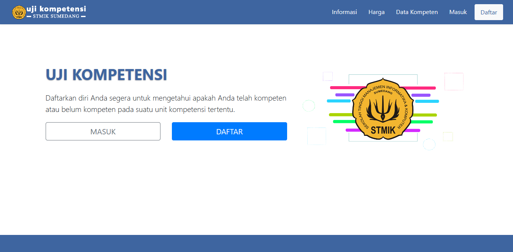

# <h1 align="center">Aplikasi Pelaksanaan Uji Kompetensi</h1>

<b>Aplikasi Pelaksanaan Uji Kompetensi</b> adalah Aplikasi berbasis web yang digunakan untuk mempermudah bagi orang-orang yang ingin melakukan
ujian kompetensi

    
## Kebutuhan

- PHP Version >= 7.3
- [Composer](https://getcomposer.org/download/)
- Apache (Web Server)
- Mysql (Database)

## Installasi

- [unduh project](https://github.com/ma-mur/ujikom/archive/main.zip) kemudian extract atau bisa dengan mengclone ke laptop Anda.
- buka terminal dan arahkan ke directory project tersebut.
- untuk mempersiapkan database terdapat 2 cara, pertama dengan mengimportkan file .sql (app_ujikom.sql) yang terdapat pada project dan yang kedua dengan menggunakan perintah <code>php artisan migrate</code> pada terminal.
- ubah file .env untuk mengkonfigurasikan database.
- jalankan perintah <code>php artisan storage:link</code> untuk membuat symbolic link agar file dapat diakses oleh public. Jika Anda lupa menjalankan perintah ini
maka <b>foto</b> dan <b>ktp</b> peserta menjadi tidak bisa ditampilkan.
- untuk menjalankan project gunakan perintah <code>php artisan serve</code> pada terminal.
- kemudian akses http://127.0.0.1:8000 atau http://localhost:8000 pada browser Anda.
- untuk masuk ke panel Admin, gunakan <code>admin@ujikom.com</code> dan password <code>admin</code> pada halaman masuk.
